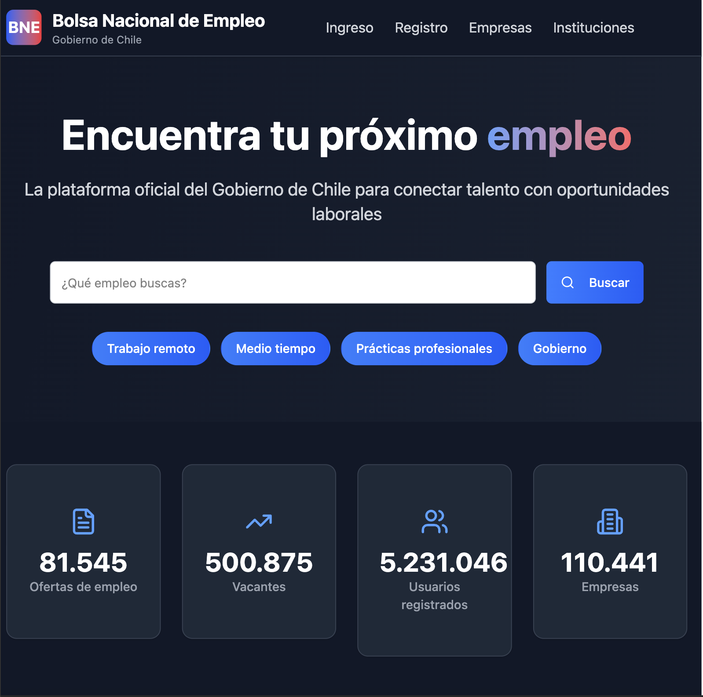

# 🚀 BNE Redesign — Bolsa Nacional de Empleo Renovada




> **Aviso legal**  
> Este proyecto **no** está afiliado a la Bolsa Nacional de Empleo (BNE) de Chile. Es una **re‑imaginación** con fines educativos y de portafolio. Visite el sitio oficial en [https://www.bne.cl](https://www.bne.cl).

---

## ✨ Características

| Función                      | Descripción                                                     |
| ---------------------------- | --------------------------------------------------------------- |
| 🎨 **UI Moderna**            | Gradientes, animaciones y diseño 100 % responsive (+ shadcn/ui) |
| 🌓 **Tema Claro / Oscuro**   | Selector Sol ☀︎ / Luna ☾ con persistencia `localStorage`        |

| 📊 **Estadísticas animadas** | Valores en vivo con **CountUp** + **framer‑motion**             |
| 💡 **Carrusel motivacional** | 4 tarjetas con gradiente e ícono centrado                       |
| 🛡 **Antiestafas**           | Sección de seguridad con lista de buenas prácticas              |

---

## 🖥️ Stack

* **TypeScript 5** (strict)
* **Tailwind CSS 3** (`darkMode: "class"`)
* **shadcn/ui** (botón, badge, card, dialog, carousel)
* **Lucide‑React** (iconos SVG)
* **framer‑motion** & **CountUp** (animaciones)


---

## 📂 Estructura rápida

````text
src/
├─ auth/
│  └─ layout/
│     └─ AuthLayout.tsx       # Layout protegido (demo)
├─ pages/components/
│  ├─ DisclaimerModal.tsx
│  ├─ Header.tsx
│  ├─ Hero.tsx
│  ├─ Stats.tsx
│  ├─ MotivationalSection.tsx
│  ├─ Services.tsx
│  ├─ ScamWarning.tsx
│  ├─ News.tsx                # Novedades
│  └─ Footer.tsx
├─ components/ui/             # shadcn/ui re‑exportados
│  ├─ badge.tsx · button.tsx · card.tsx · dialog.tsx
│  ├─ input.tsx · carousel.tsx …
│  └─ index.ts                # barrel
├─ components/ThemeToggle.tsx # botón Sol / Luna
├─ tour/TourProvider.tsx      # contexto + Driver.js
├─ assets/                    # logos e íconos locales
└─ App.tsx / main.tsx         # entry Vite

````

---

## 🚀 Instalación

```bash
# 1 Clona el repo
$ git clone https://github.com/reikem/bne-redesign.git
$ cd bne-redesign

# 2 Instala dependencias
$ pnpm i      # ó npm / yarn

# 3 Modo desarrollo
$ pnpm dev    # abre http://localhost:5173
```

\### Build producción

```bash
pnpm build && pnpm start
```

---

## 📱 Responsive

Optimizado para **mobile · tablet · desktop** usando breakpoints de Tailwind (`sm → 2xl`).

---

## 🗺️ Roadmap

* [ ] API real BNE
* [ ] Filtros avanzados de búsqueda
* [ ] PWA + push
* [ ] Tests E2E con Playwright

---

## 🤝 Contribución

1. *Fork* → `git checkout -b feature/Amazing`
2. *Commit* → `git commit -m "feat: Amazing"`
3. *Push* → `git push origin feature/Amazing`
4. Abre un **PR**

---

## 📄 Licencia

MIT © 2025 — [@reikem](https://github.com/reikem)
**Link de la aplicación https://reikem.github.io/bne_reinvention/**
